# Getting Started

* [Overview](#overview)
* [Background Information](#background-information)
* [Clone Toolkit Repository](#clone-toolkit-repository)
* [Create Unity Project](#create-unity-project)
* [Add Toolkit Folder](#add-toolkit-folder)
* [Add Inference Features](#add-inference-features)
* [Allow Unsafe Code](#allow-unsafe-code)
* [Install Barracuda Package](#install-barracuda-package)
* [Add Input Data](#add-input-data)

## Overview

In this tutorial we will provide a basic demonstration of how to incorporate the [AIGamedevToolkit](https://www.intel.com/content/www/us/en/developer/articles/training/ai-gamedev-toolkit-tutorials.html) into a [Unity](https://unity.com/) project. By the end, you will know how to run a [deep learning](https://community.intel.com/t5/Blogs/Tech-Innovation/Artificial-Intelligence-AI/The-Difference-Between-Artificial-Intelligence-Machine-Learning/post/1335666) model inside a Unity scene, without any additional coding.

## Background Information

For our purposes, a model can be thought of like a function in traditional programming. A model takes in input and returns an output. Unlike in traditional programming, the desired function is not explicitly coded, but [approximated](https://machinelearningmastery.com/neural-networks-are-function-approximators/) based on a sample dataset. The sample dataset provides a mapping of input values to output values.  As an example, a model could approximate a function that takes in an image as input and returns the locations and types of objects in the image based on a sample dataset of annotated images.

A deep learning model consists of a sequence of explicitly coded functions called layers where output from the previous layer serves as input for the next. The combination of the types and arrangement of functions is referred to as the model's architecture. These internal functions have parameters that are learned based on the sample data through a process called [training](https://community.intel.com/t5/Blogs/Tech-Innovation/Artificial-Intelligence-AI/The-Difference-Between-Deep-Learning-Training-and-Inference/post/1335634). The goal of training is to find the values for these internal parameters that enable the model to best approximate the desired function.

In theory, this approach can be used to approximate any function. However, it is best suited to applications where it would be infeasible to explicitly define the desired function. It can also be useful for approximating more efficient versions of computationally intensive functions, typically with some decrease in accuracy.

In the AIGamedevToolkit, a model's functionality is accessed through an `InferenceFeature` asset. [Inference](https://community.intel.com/t5/Blogs/Tech-Innovation/Artificial-Intelligence-AI/The-Difference-Between-Deep-Learning-Training-and-Inference/post/1335634) refers to using a [trained](https://community.intel.com/t5/Blogs/Tech-Innovation/Artificial-Intelligence-AI/The-Difference-Between-Deep-Learning-Training-and-Inference/post/1335634) deep learning model to make predictions on new inputs. In the toolkit, an inference feature implements the required steps for performing inference with a specific type of deep learning model. For this tutorial, we shall use some predefined inference features that are included with the toolkit. We will cover how to implement new inference features for custom pretrained models in a future tutorial. 

## Clone Toolkit Repository

First, we need to clone the [GitHub repository](https://github.com/IntelSoftware/AIGamedevToolkit) for the toolkit. Make sure to actually clone the repository rather than downloading it as a `.zip`. Compressing the project folder can break some of the binary files included in the toolkit.

## Create Unity Project

Next, we need to a create Unity project to use the toolkit. We can stick with the default template for a 3D project.

## Add Toolkit Folder

Once the Unity Editor has loaded, we can add the toolkit folder. Open the AIGamedevToolkit repository folder and select the `AIGamedevToolkit` subfolder.

Drag the toolkit folder into the `Project → Assets` directory.

## Add Inference Features

The toolkit comes with some predefined `InferenceFeature` assets for both Intel's [OpenVINO](https://docs.openvino.ai/latest/index.html) and Unity's [Barracuda](https://docs.unity3d.com/Packages/com.unity.barracuda@2.0/manual/index.html) inference libraries.

An inference library refers to the code used to perform the internal operations in a trained model. The OpenVINO inference library is optimized to speed up model inference on Intel hardware while the Barracuda library provides cross-platform support.

The predefined assets are located in the `Assets → AIGamedevToolkit → ScriptableObjects → InferenceFeatures` folder.

Here, we can see there are three predefined assets.

* COCO_YOLOX: An OpenVINO inference feature which uses [object detection](https://www.fritz.ai/object-detection/) models that were trained on the [COCO](https://cocodataset.org/#home) (Common Objects in Context) image dataset. The model can detect [80 different types](https://cocodataset.org/#explore) of real world objects in an input image. [YOLOX](https://github.com/Megvii-BaseDetection/YOLOX) refers to the name of the specific architecture used by the object detection models.
* StyleTransfer_Barracuda: A Barracuda inference feature which uses models that were trained to apply the artistic style of a particular image to an arbitrary input image.
* StyleTransfer_OpenVINO: An OpenVINO inference feature which uses models that were trained to apply the artistic style of a particular image to an arbitrary input image.

The toolkit adds a graphical user interface (GUI) for adding inference features to a scene. This GUI can be accessed from the `Window → AI Gamedev Toolkit` submenu. Open the submenu and select `Add Inference Features`. The toolkit will automatically look for any `InferenceFeature` assets and display them in a popup window.

## Allow Unsafe Code

As we can see in the new window, there is a warning that unsafe code needs to be enabled to use OpenVINO inference features. This is because the memory location containing the pixel data for an input image needs to be accessed from a DLL plugin.

If we try to view the options for an OpenVINO inference feature, we can see the same message.

We can enable unsafe code in the the Player Settings. Open the `Edit` menu and select `Project Settings...`.

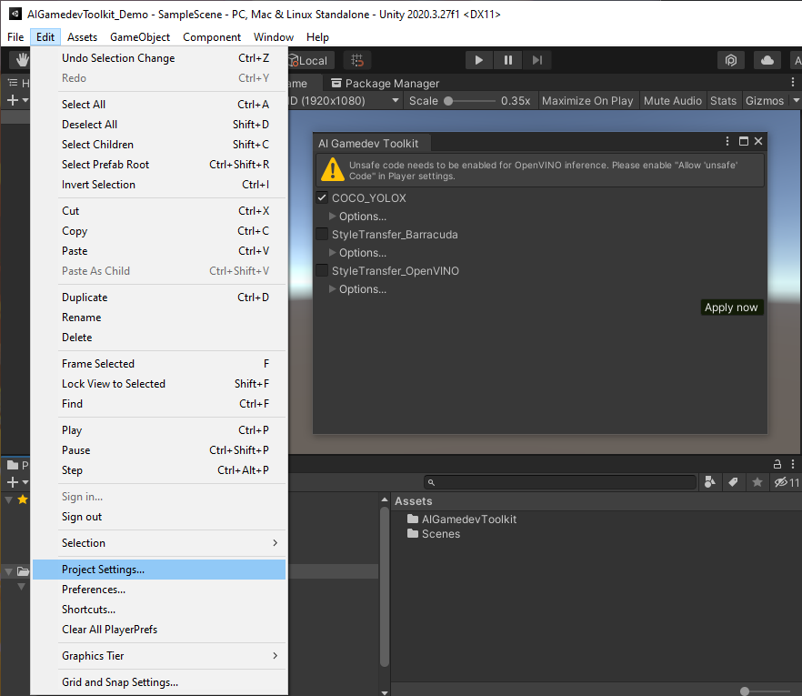

Open the Player submenu and scroll down to the `Allow 'unafe' Code` parameter. Tick the checkbox for the parameter and close the Project Settings window.

The toolkit will automatically detect that the setting was enabled and unlock the inference feature settings after a few seconds. We will explore the settings for the inference features in greater detail in another post. For now, we can stick with the default settings.

> **Note:** The OpenVINO inference library is optimized for Intel hardware. By default, OpenVINO inference features will only run if Intel hardware is detected.

## Install Barracuda Package

If we try to view the options for a Barracuda inference feature we see a similar warning message indicating that the [Barracuda package](https://github.com/Unity-Technologies/barracuda-release) is not installed.

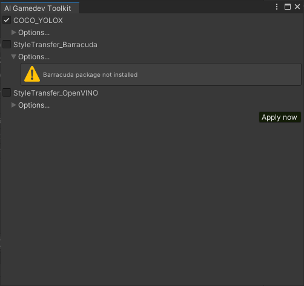

We can install the Barracuda package from the Package Manager window. Select the Package Manager tab and click on the `+` sign in the top-left corner.

Select the `Add package from git URL...` option from the dropdown.

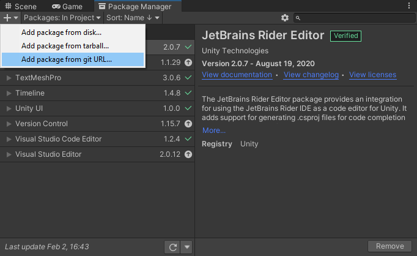

Type `com.unity.barracuda` into the text field and click `Add`.

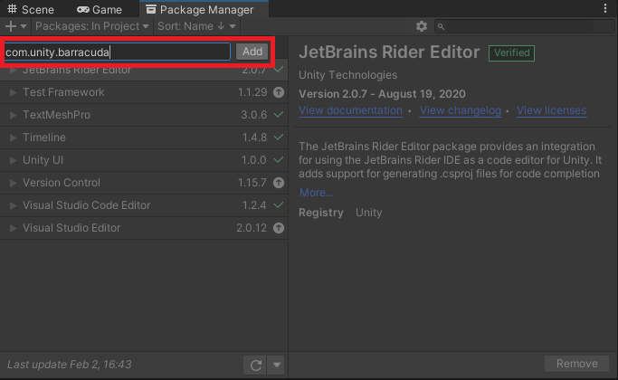

The latest stable version of Barracuda at the time of writing is version `2.0.0`.

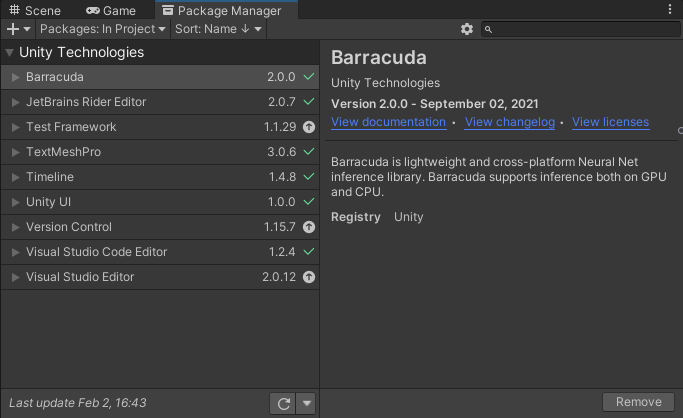

As with enabling unsafe code, the toolkit will automatically detect that the Barracuda package was installed and unlock the inference feature settings. If we go back to the AIGameDev Toolkit window, we can now see and interact with the Barracuda inference feature.

We can stack multiple inference features, but we'll stick with adding just one for now. If you are running on Intel hardware stick with the default `COCO_YOLOX` selection. Otherwise, deselect the `COCO_YOLOX` inference feature and select the `StyleTransfer_Barracuda` option. Click on `Apply now` to add the inference feature to the scene.

The toolkit makes some assumptions about the scene when adding inference features through the `AI Gamedev Toolkit` window.

When adding [computer vision](https://machinelearningmastery.com/what-is-computer-vision/) inference features, which take in images as input, the toolkit will attach a helper script to the in-game camera. This script is responsible for getting the texture data for the current frame and making it accessible to any computer vision inference features.

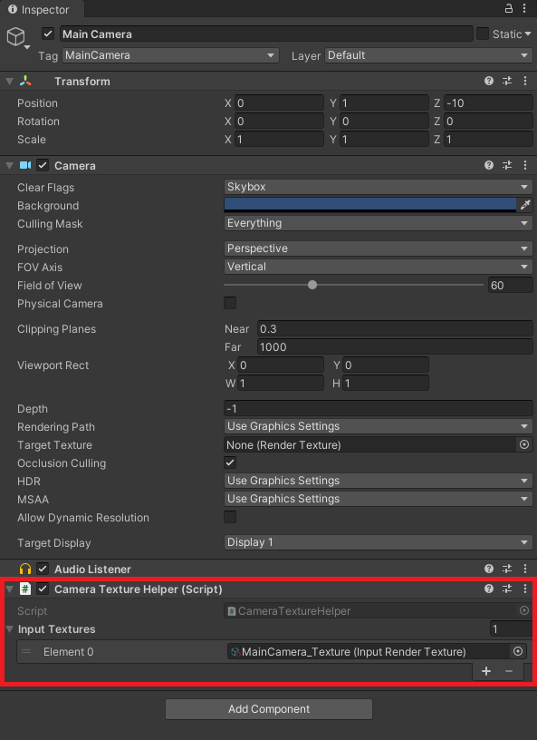

Some inference features like the `COCO_YOLOX` asset will only use the current camera frame as input for their deep learning model. Others, like the two style transfer inference features, will also modify the texture data for the current camera frame like a post-processing effect.

The toolkit will also create a new GameObject called `Inference Manager` with an [`InferenceManager`](https://github.com/IntelSoftware/AIGamedevToolkit/blob/main/AIGamedevToolkit/Scripts/InferenceManager.cs) component and attach the selected inference features to the component. The Inference Manager provides a central place to configure and initialize any Inference Features in the Unity scene.

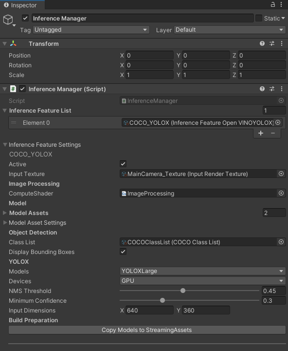

When adding object detection inference features like the `COCO_YOLOX` asset, an additional GameObject will be added called `Bounding Box Manager`. This will have a [`BoundingBoxManager`](https://github.com/IntelSoftware/AIGamedevToolkit/blob/main/AIGamedevToolkit/Scripts/ObjectDetection/BoundingBoxManager.cs) component and any object detection inference features in the scene will be attached. This GameObject will be responsible for drawing boxes around any detected objects and indicating their predicted object type.

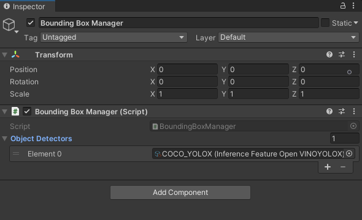

## Add Input Data

At this point, we could go ahead and press play and the object detection model would take input from the in-game camera. However, since the scene is blank, we won't see any bounding boxes displayed. We need to add some input data.

We could either create a game environment containing objects to detect or get input from a video feed. Since the object detection model being used was trained exclusively on real-world images, we will go with a video feed for now.

The toolkit provides built-in options for creating a video feed using a video file or an attached webcam. For either option, we first need to create a screen to view the video feed.

Right-click an empty area in the Hierarchy tab and select `3D Object → Quad ` from the popup menu.

We can just name the new object `VideoScreen`. With the video screen object selected, click `Add Component` in the Inspector tab. 

Type `Video Screen Manager` into the search bar and press `Enter`.

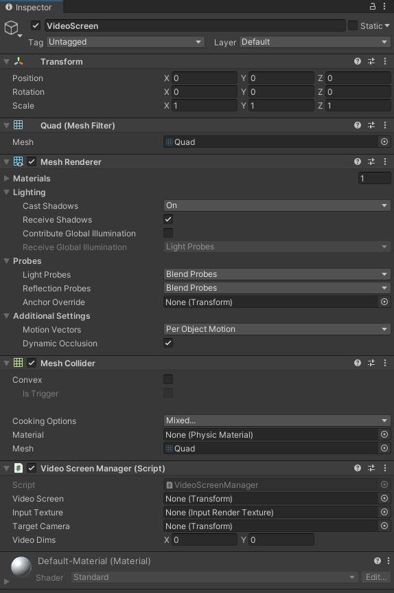

Drag the `VideoScreen` object from the Hierarchy tab into the `Video Screen` field for the `VideoScreenManager` component. This will allow the `Quad` dimensions to be updated based on the current video dimensions.

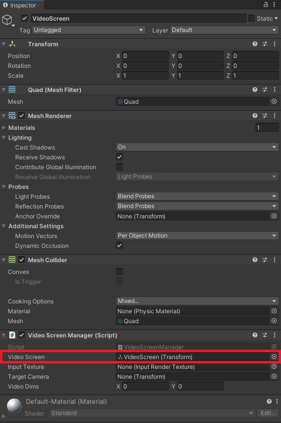

Next we need an input texture to store the pixel data for the video feed. Click on the little circle icon at the end of the `Input Texture` field. 

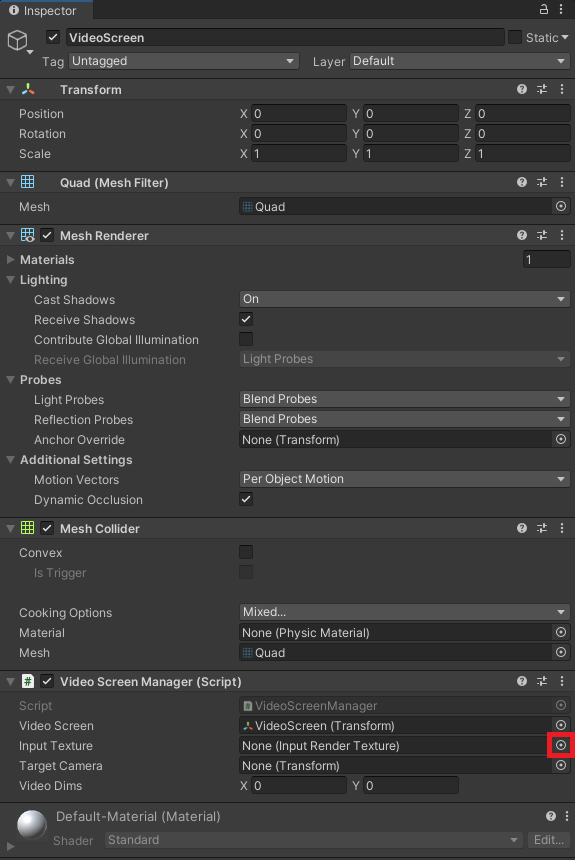

Select the `VideoPlayer_Texture` asset in the popup window.

Lastly, drag the in-game camera from the Hierarchy Tab into the `Target Camera` field. This will allow the camera to be repositioned based on the the current video dimensions. The `Video Dims` field will be updated based on the current video dimensions.

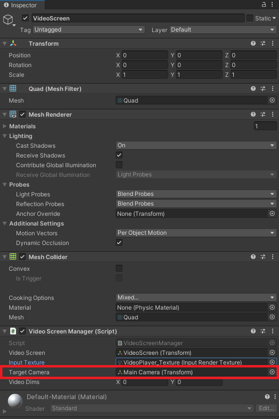

We can use a video file or webcam feed by adding a either a `Video Manager` or `Webcam Manager` component respectively to the `VideoScreen`. 

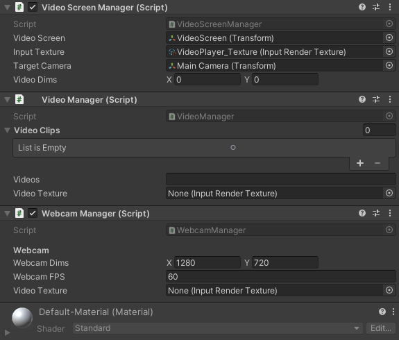

In both cases, we need to assign the same `VideoPlayer_Texture` asset as is used for the `Video Screen Manager` component to the `Video Texture` field.

When using a Video Manager we also need to populate the `Video Clips` field with video files. Feel free to use your own video files or use the [sample videos](https://github.com/IntelSoftware/aigamedevtoolkit-starter-demos/tree/main/AIGamedevToolkit_Demo/Assets/Videos) included in the pre-configured demo project. 

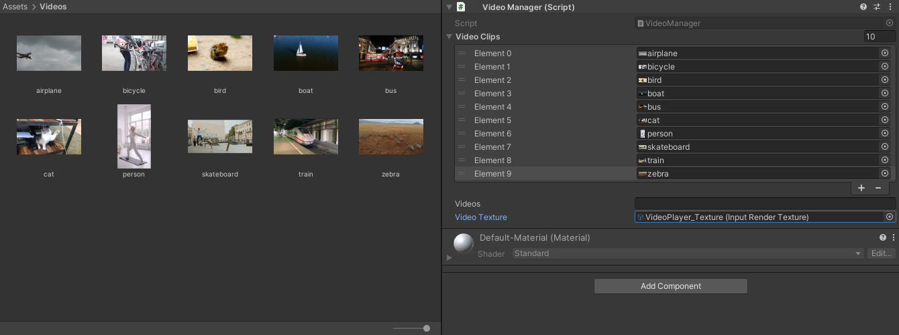

The last component we need to add to the `VideoScreen` is a `VideoPlayer` to play the video clips. Make sure to enable the `Loop` parameter for the Video Player component.

Now if we press play, we should see that bounding boxes are drawn around objects detected in the video.

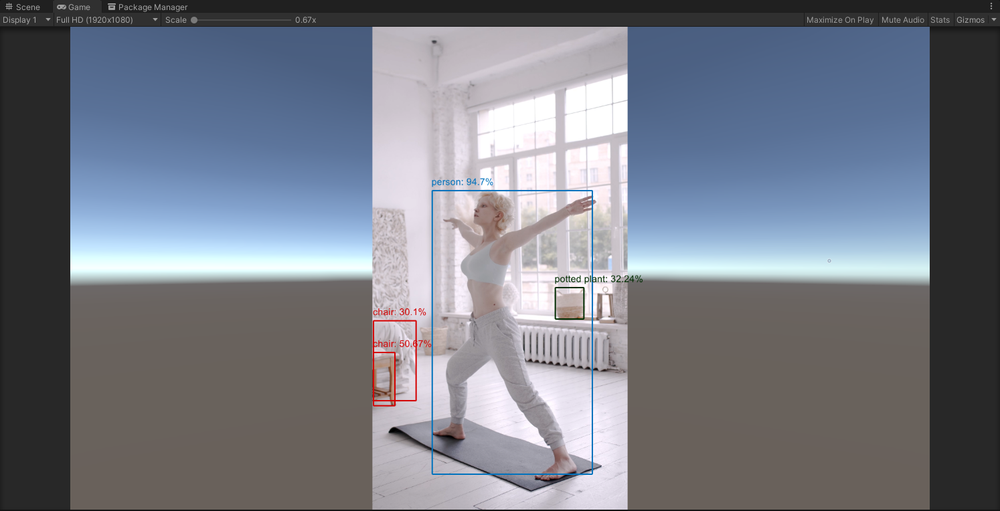

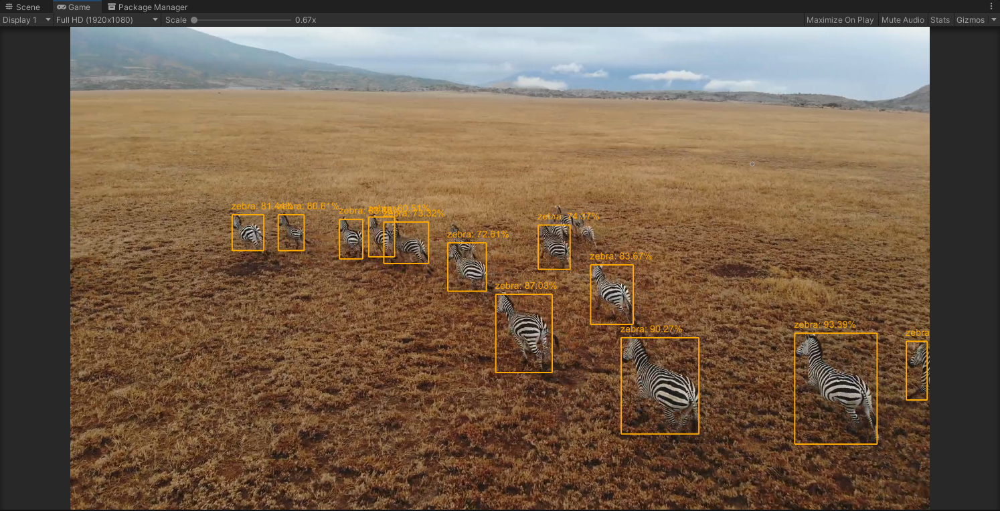

The full list of object types that can be detected using the `COCO_YOLOX` inference feature is provided below.

COCO Dataset Object Classes

| Index | Name           |
| ----- | -------------- |
| 0     | person         |
| 1     | bicycle        |
| 2     | car            |
| 3     | motorcycle     |
| 4     | airplane       |
| 5     | bus            |
| 6     | train          |
| 7     | truck          |
| 8     | boat           |
| 9     | traffic light  |
| 10    | fire hydrant   |
| 11    | stop sign      |
| 12    | parking meter  |
| 13    | bench          |
| 14    | bird           |
| 15    | cat            |
| 16    | dog            |
| 17    | horse          |
| 18    | sheep          |
| 19    | cow            |
| 20    | elephant       |
| 21    | bear           |
| 22    | zebra          |
| 23    | giraffe        |
| 24    | backpack       |
| 25    | umbrella       |
| 26    | handbag        |
| 27    | tie            |
| 28    | suitcase       |
| 29    | frisbee        |
| 30    | skis           |
| 31    | snowboard      |
| 32    | sports ball    |
| 33    | kite           |
| 34    | baseball bat   |
| 35    | baseball glove |
| 36    | skateboard     |
| 37    | surfboard      |
| 38    | tennis racket  |
| 39    | bottle         |
| 40    | wine glass     |
| 41    | cup            |
| 42    | fork           |
| 43    | knife          |
| 44    | spoon          |
| 45    | bowl           |
| 46    | banana         |
| 47    | apple          |
| 48    | sandwich       |
| 49    | orange         |
| 50    | broccoli       |
| 51    | carrot         |
| 52    | hot dog        |
| 53    | pizza          |
| 54    | donut          |
| 55    | cake           |
| 56    | chair          |
| 57    | couch          |
| 58    | potted plant   |
| 59    | bed            |
| 60    | dining table   |
| 61    | toilet         |
| 62    | tv             |
| 63    | laptop         |
| 64    | mouse          |
| 65    | remote         |
| 66    | keyboard       |
| 67    | cell phone     |
| 68    | microwave      |
| 69    | oven           |
| 70    | toaster        |
| 71    | sink           |
| 72    | refrigerator   |
| 73    | book           |
| 74    | clock          |
| 75    | vase           |
| 76    | scissors       |
| 77    | teddy bear     |
| 78    | hair drier     |
| 79    | toothbrush     |

> **Note:** If you went with one of the style transfer inference features you should see something like the image below.
>
> 

As mentioned before, we can can also stack multiple inference features. Although, this might not be advisable for performance reasons, depending on the models being used.

